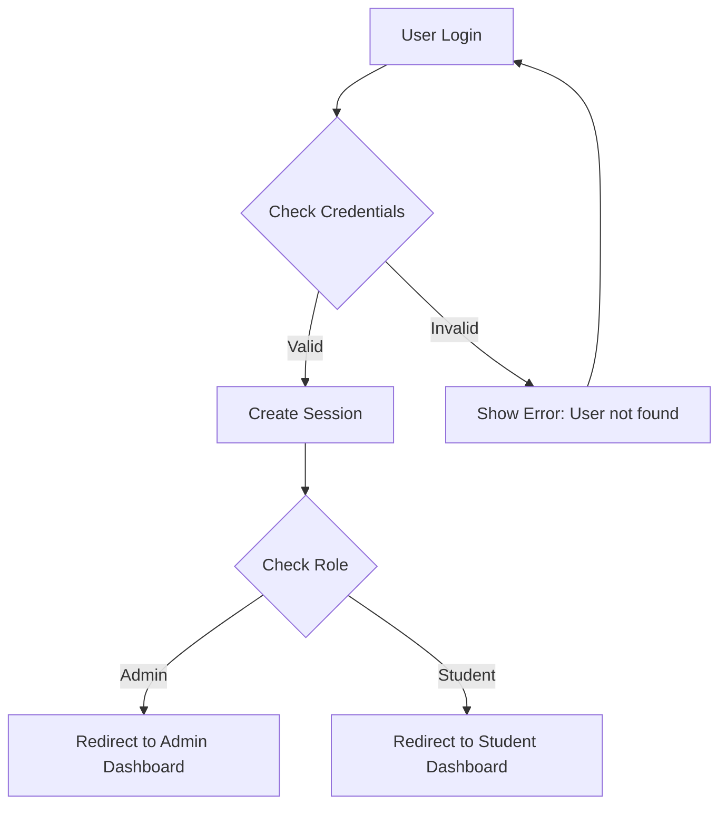

# Hosur Toppers Academy - Educational Management System


## 📚 Project Overview

**Hosur Toppers Academy** is a comprehensive educational management system designed for coaching institutes. It provides a complete solution for managing students, courses, results, and administrative tasks with modern web technologies.

### 🏛️ About the Institute
- **Name**: Hosur Toppers Academy
- **Tagline**: "Source of knowledge"
- **Location**: Maruthi Nagar, Hosur, Tamil Nadu 635126
- **Experience**: 23+ years in education
- **Specialization**: Foundation courses (Classes 9-12), NEET & JEE preparation

## 🏗️ Architecture

### Full-Stack Application
```
┌─────────────────┐    ┌─────────────────┐    ┌─────────────────┐
│   Frontend      │    │    Backend      │    │   Firebase      │
│   React.js      │────│   FastAPI       │────│   Firestore     │
│   Tailwind CSS  │    │   Python 3.12   │    │   Auth          │
│   Port: 3001    │    │   Port: 8000    │    │   Storage       │
└─────────────────┘    └─────────────────┘    └─────────────────┘
```

## 🎯 Key Features

### 👨‍💼 Admin Features
- **Student Management**: Add, edit, delete students
- **Result Management**: Publish exam results
- **Course Management**: Manage course offerings
- **Inquiry Management**: Handle student inquiries
- **Dashboard Analytics**: Overview of academy performance

### 👨‍🎓 Student Features
- **Student Portal**: View personal dashboard
- **Results Access**: Check exam results
- **Course Information**: Browse available courses
- **Profile Management**: Update personal information

### 🔐 Authentication System
- **Role-based Access**: Admin and Student roles
- **Firebase Authentication**: Secure login system
- **Session Management**: Auto-logout on page refresh
- **Password Security**: Students use date of birth as password

### 📱 Additional Features
- **Responsive Design**: Works on all devices
- **Email Integration**: EmailJS for notifications
- **WhatsApp Integration**: Direct messaging
- **Gallery System**: Showcase academy events
- **Toppers Showcase**: Highlight successful students

## 📁 Project Structure

```
Hosur_Acadamy/
├── 📁 frontend/                    # React.js Frontend
│   ├── 📁 src/
│   │   ├── 📁 components/          # Reusable UI components
│   │   │   ├── 📁 ui/             # Shadcn/ui components
│   │   │   ├── 📁 mock/           # Mock data for development
│   │   │   ├── Header.jsx         # Navigation header
│   │   │   ├── Footer.jsx         # Page footer
│   │   │   └── ...
│   │   ├── 📁 pages/              # Route components
│   │   │   ├── Home.jsx           # Landing page
│   │   │   ├── Login.jsx          # Authentication page
│   │   │   ├── Admin.jsx          # Admin dashboard
│   │   │   ├── StudentDashboard.jsx
│   │   │   └── ...
│   │   ├── 📁 contexts/           # React contexts
│   │   │   ├── AuthContext.jsx    # Authentication state
│   │   │   └── ...
│   │   ├── 📁 lib/                # Utility libraries
│   │   │   ├── firebase.js        # Firebase configuration
│   │   │   ├── api.js             # API client functions
│   │   │   ├── database.js        # Firestore operations
│   │   │   └── ...
│   │   ├── 📁 hooks/              # Custom React hooks
│   │   ├── 📁 utils/              # Helper functions
│   │   └── App.jsx                # Main application
│   ├── 📁 public/                 # Static assets
│   ├── package.json               # Dependencies
│   └── tailwind.config.js         # Styling configuration
├── 📁 backend/                    # Python FastAPI Backend
│   ├── server.py                  # Main API server
│   ├── requirements.txt           # Python dependencies
│   ├── Dockerfile                 # Docker configuration
│   └── 📁 venv/                   # Virtual environment
├── 📁 Configuration Files
│   ├── firebase.json              # Firebase hosting config
│   ├── firestore.rules           # Database security rules
│   ├── firestore.indexes.json    # Database indexes
│   ├── storage.rules             # File storage rules
│   ├── vercel.json               # Vercel deployment config
│   └── nginx.conf                # Nginx configuration
├── 📁 Documentation
│   ├── FIREBASE-README.md         # Firebase setup guide
│   ├── FIREBASE-DEPLOYMENT-GUIDE.md
│   ├── BACKEND-DEPLOYMENT.md      # Backend deployment
│   └── SCROLL_IMPROVEMENTS.md    # UI enhancements
└── README.md                      # This file
```

## 🛠️ Technology Stack

### Frontend Technologies
- **React 18.2.0** - Modern UI library
- **React Router DOM** - Client-side routing
- **Tailwind CSS** - Utility-first styling
- **Shadcn/ui** - High-quality UI components
- **Radix UI** - Accessible component primitives
- **EmailJS** - Email service integration
- **Axios** - HTTP client for API calls
- **React Hook Form** - Form handling
- **Lucide React** - Icon library

### Backend Technologies
- **FastAPI** - Modern Python web framework
- **Python 3.12** - Programming language
- **Pydantic** - Data validation
- **Uvicorn** - ASGI server
- **Python-dotenv** - Environment management
- **Firebase Admin SDK** - Backend Firebase integration

### Database & Cloud Services
- **Firebase Firestore** - NoSQL document database
- **Firebase Authentication** - User management
- **Firebase Storage** - File storage
- **Firebase Hosting** - Static site hosting

### Development Tools
- **Create React App** - Frontend build tool
- **CRACO** - CRA configuration override
- **ESLint** - Code linting
- **Black** - Python code formatting
- **Git** - Version control

## 🚀 Getting Started

### Prerequisites
- **Node.js** (v16 or higher)
- **Python** (v3.12 or higher)
- **Git**
- **Firebase CLI**
- **Code Editor** (VS Code recommended)

### 1. Clone the Repository
```bash
git clone https://github.com/Surajkumaar/Hosur_Acadamy.git
cd Hosur_Acadamy
```

### 2. Frontend Setup
```bash
# Navigate to frontend directory
cd frontend

# Install dependencies
npm install

# Create environment file
cp .env.example .env

# Start development server
npm start
```

The frontend will run on `http://localhost:3001`

### 3. Backend Setup
```bash
# Navigate to backend directory
cd backend

# Create virtual environment
python -m venv venv

# Activate virtual environment
# Windows:
venv\Scripts\activate
# macOS/Linux:
source venv/bin/activate

# Install dependencies
pip install -r requirements.txt

# Start development server
uvicorn server:app --reload --port 8000
```

The backend API will run on `http://localhost:8000`

### 4. Firebase Setup

#### Install Firebase CLI
```bash
npm install -g firebase-tools
```

#### Login to Firebase
```bash
firebase login
```

#### Initialize Firebase Project
```bash
firebase init

# Select the following services:
# ☑ Firestore: Deploy rules and create indexes
# ☑ Functions: Configure and deploy Firebase Functions
# ☑ Hosting: Configure and deploy Firebase hosting sites
# ☑ Storage: Deploy Cloud Storage security rules
```

#### Configure Environment Variables
Create `.env` file in the frontend directory:
```env
REACT_APP_FIREBASE_API_KEY=your_api_key_here
REACT_APP_FIREBASE_AUTH_DOMAIN=your_project_id.firebaseapp.com
REACT_APP_FIREBASE_PROJECT_ID=your_project_id
REACT_APP_FIREBASE_STORAGE_BUCKET=your_project_id.appspot.com
REACT_APP_FIREBASE_MESSAGING_SENDER_ID=your_messaging_sender_id
REACT_APP_FIREBASE_APP_ID=your_app_id
REACT_APP_FIREBASE_MEASUREMENT_ID=your_measurement_id
```

## 🔥 Firebase Commands Reference

### Authentication Commands
```bash
# List Firebase projects
firebase projects:list

# Select active project
firebase use your-project-id

# Get current project info
firebase projects:list --format=json
```

### Deployment Commands
```bash
# Deploy everything
firebase deploy

# Deploy only hosting
firebase deploy --only hosting

# Deploy only Firestore rules
firebase deploy --only firestore:rules

# Deploy only Firestore indexes
firebase deploy --only firestore:indexes

# Deploy only storage rules
firebase deploy --only storage

# Deploy specific functions
firebase deploy --only functions:functionName
```

### Development Commands
```bash
# Start Firebase emulators
firebase emulators:start

# Start specific emulators
firebase emulators:start --only hosting,firestore

# View emulator UI
# Open http://localhost:4000 in browser
```

### Database Commands
```bash
# Import data to Firestore
firebase firestore:delete --all-collections --yes

# Export Firestore data
firebase firestore:export gs://your-bucket/backup-folder

# Import Firestore data
firebase firestore:import gs://your-bucket/backup-folder
```

### Hosting Commands
```bash
# Initialize hosting
firebase init hosting

# Set hosting target
firebase target:apply hosting main your-project-id

# View hosting URL
firebase hosting:sites:list
```

## 💾 Database Schema

### Collections Structure

#### 🎓 Students Collection
```javascript
students: {
  studentId: {
    id: "unique_id",
    name: "Student Name",
    email: "student@example.com",
    roll_no: "ROLL001",
    course: "JEE Preparation",
    batch: "2024-25",
    phone: "+91-XXXXXXXXXX",
    date_of_birth: "2000-01-15",
    createdAt: timestamp,
    updatedAt: timestamp
  }
}
```

#### 📚 Courses Collection
```javascript
courses: {
  courseId: {
    id: "unique_id",
    title: "Foundation Course",
    description: "Strong foundation for grades 9-10",
    subject: "Physics, Chemistry, Math",
    grade: "9-10",
    duration: "1 Year",
    price: "₹25,000",
    features: ["Activity-Based Teaching", "Regular Tests"],
    image: "course_image_url"
  }
}
```

#### 📊 Results Collection
```javascript
results: {
  resultId: {
    id: "unique_id",
    exam_name: "Monthly Test - March",
    exam_date: "2024-03-15",
    course: "JEE Preparation",
    batch: "2024-25",
    results: [
      {
        student_id: "student_id",
        marks: 85,
        rank: 5,
        remarks: "Good performance"
      }
    ]
  }
}
```

#### ❓ Inquiries Collection
```javascript
inquiries: {
  inquiryId: {
    id: "unique_id",
    name: "Parent Name",
    email: "parent@example.com",
    phone: "+91-XXXXXXXXXX",
    course: "JEE Preparation",
    grade: "11",
    message: "Inquiry about admission",
    timestamp: timestamp,
    status: "pending" // pending, responded, closed
  }
}
```

#### 🏆 Toppers Collection
```javascript
toppers: {
  topperId: {
    id: "unique_id",
    name: "Topper Name",
    rank: "AIR 1",
    exam: "JEE Advanced 2024",
    score: "99.8%",
    course: "JEE Preparation",
    testimonial: "Academy helped me achieve my dreams",
    image: "topper_photo_url"
  }
}
```

#### 🖼️ Gallery Collection
```javascript
gallery: {
  galleryId: {
    id: "unique_id",
    title: "Annual Day Celebration",
    description: "Students celebrating achievements",
    category: "events", // events, classroom, achievements
    image: "image_url",
    createdAt: timestamp
  }
}
```

## 🔐 Authentication Flow

### Admin Login
1. **Email**: admin@example.com
2. **Password**: admin
3. **Access**: Full system administration

### Student Login
1. **Email**: student's registered email
2. **Password**: Date of birth (YYYY-MM-DD format)
3. **Access**: Personal dashboard and results

### Authentication Process


## 🌐 API Endpoints

### Authentication Endpoints
```
POST /api/login          # User authentication
POST /api/logout         # User logout
GET  /api/user           # Get current user info
```

### Student Management
```
GET    /api/students     # List all students
POST   /api/students     # Create new student
PUT    /api/students/:id # Update student
DELETE /api/students/:id # Delete student
GET    /api/students/me  # Get current student info
```

### Course Management
```
GET /api/courses         # List all courses
GET /api/courses/:id     # Get course details
```

### Results Management
```
GET  /api/results        # List all results
POST /api/results        # Publish new results
GET  /api/results/:id    # Get specific result
```

### General Endpoints
```
GET  /api/inquiries      # List inquiries
POST /api/inquiries      # Submit inquiry
GET  /api/toppers        # List toppers
GET  /api/gallery        # List gallery items
```

## 🔒 Security Features

### Firebase Security Rules

#### Firestore Rules
```javascript
rules_version = '2';
service cloud.firestore {
  match /databases/{database}/documents {
    // Students can read their own data
    match /students/{studentId} {
      allow read, write: if request.auth != null && 
        request.auth.uid == studentId;
    }
    
    // Admin can access everything
    match /{document=**} {
      allow read, write: if request.auth != null && 
        get(/databases/$(database)/documents/users/$(request.auth.uid)).data.role == 'admin';
    }
  }
}
```

#### Storage Rules
```javascript
rules_version = '2';
service firebase.storage {
  match /b/{bucket}/o {
    match /{allPaths=**} {
      allow read, write: if request.auth != null;
    }
  }
}
```

### Backend Security
- **CORS Configuration**: Restricted origins
- **Input Validation**: Pydantic models
- **Authentication Middleware**: JWT token validation
- **Role-based Access Control**: Admin/Student permissions

## 🚢 Deployment

### Frontend Deployment (Firebase Hosting)
```bash
# Build production version
npm run build

# Deploy to Firebase
firebase deploy --only hosting

# Custom domain setup
firebase hosting:sites:create your-custom-domain
firebase target:apply hosting production your-custom-domain
```

### Backend Deployment Options

#### Option 1: Docker Deployment
```bash
# Build Docker image
docker build -t hosur-academy-backend .

# Run container
docker run -p 8000:8000 hosur-academy-backend
```

#### Option 2: Cloud Platform (Railway/Render)
```bash
# Create Procfile
echo "web: uvicorn server:app --host=0.0.0.0 --port=\$PORT" > Procfile

# Deploy to platform of choice
```

### Environment Variables for Production
```env
# Frontend (.env.production)
REACT_APP_API_URL=https://your-backend-url.com
REACT_APP_FIREBASE_API_KEY=production_api_key
# ... other Firebase config

# Backend
DATABASE_URL=your_production_database_url
SECRET_KEY=your_secret_key
CORS_ORIGINS=https://your-frontend-url.com
```

## 🧪 Testing

### Frontend Testing
```bash
# Run tests
npm test

# Run tests with coverage
npm test -- --coverage

# Run specific test
npm test -- --testNamePattern="Login"
```

### Backend Testing
```bash
# Install test dependencies
pip install pytest pytest-cov

# Run tests
pytest

# Run with coverage
pytest --cov=.
```

## 📊 Monitoring & Analytics

### Firebase Analytics
- **User Engagement**: Track user interactions
- **Performance**: Monitor app performance
- **Crash Reporting**: Automatic error tracking

### Custom Metrics
- **Student Enrollments**: Track new registrations
- **Result Views**: Monitor result access
- **Inquiry Submissions**: Track lead generation

## 🛠️ Development Workflow

### Git Workflow
```bash
# Feature development
git checkout -b feature/new-feature
git add .
git commit -m "feat: add new feature"
git push origin feature/new-feature

# Create pull request
# Merge after review
```

### Code Quality
```bash
# Frontend linting
npm run lint
npm run lint:fix

# Backend formatting
black .
isort .
flake8 .
```

### Pre-deployment Checklist
- [ ] All tests passing
- [ ] Environment variables configured
- [ ] Firebase rules updated
- [ ] Database indexes created
- [ ] CORS settings configured
- [ ] SSL certificates valid

## 🤝 Contributing

### Getting Started
1. Fork the repository
2. Create a feature branch
3. Make your changes
4. Add tests if applicable
5. Submit a pull request

### Code Standards
- **Frontend**: ESLint + Prettier
- **Backend**: Black + isort + flake8
- **Commits**: Conventional commit messages
- **Documentation**: Update README for new features

## 📞 Support & Contact

### Technical Support
- **Email**: hosurtoppersacadamy@gmail.com
- **Phone**: +91-8248637277
- **WhatsApp**: +91-8248637277

### Development Team
- **Repository**: https://github.com/Surajkumaar/Hosur_Acadamy
- **Issues**: https://github.com/Surajkumaar/Hosur_Acadamy/issues
- **Discussions**: https://github.com/Surajkumaar/Hosur_Acadamy/discussions

## 📄 License

This project is proprietary software owned by Hosur Toppers Academy. All rights reserved.

## 🙏 Acknowledgments

- **React Team** for the amazing framework
- **Firebase Team** for the backend services
- **FastAPI Team** for the excellent Python framework
- **Tailwind CSS** for the utility-first styling
- **Shadcn/ui** for the beautiful components

---

**© 2025 Hosur Toppers Academy. All rights reserved.**

*Last updated: September 27, 2025*